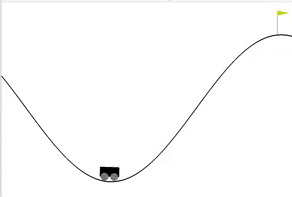
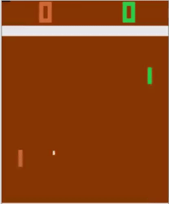

# Build AI for Atari Ping Pong 🏓
#### Implemented deep reinforcement learning (deep Q-learning) applied to play a Cart Pole game, Mountain Car using Keras and OpenAI gym.

An exploration of how to use OpenAI Gym to teach an AI to play games, from basic tasks like Mountain Car, to Atari Pong.

#### Cart Pole:

#### Mountain Car:

#### Atari Pong:

## Inspiration
There’s a huge difference between reading about Reinforcement Learning and actually implementing it.I implemented a Neural Network for RL and see it learn more and more as it finally becomes good enough to beat the computer in Pong! You can play around with other such Atari games at the OpenAI Gym.The algorithm took 4 days of training to start beating the computer.
I never really branched out in my ML projects beyond plugging in some SciKitLearn packages and crossing my fingers.So, I spent some time learning about reinforcement learning and DQN, and taught an AI to play some games (with a lot of help). 🙏🏾

## Installation
1. Follow the instructions for installing OpenAI Gym [here](https://gym.openai.com/docs). You may need to install `cmake` first.
2. Install NumPy: `pip install numpy`
3. Install TensorFlow: `pip install tensorflow`
4. Install Keras: `pip install keras`

## Usage
#### To run the cart pole example (this takes around 10 minutes to train)
    $ python cart_pole.py

#### To run the mountain car example (this takes around 20 minutes to train)
    $ python mountain_car.py

#### To run the mountain car example (this takes 3-5 days to train)
    $ python pingpong.py

## Thanks

* [Deep Q Learning Starter Code](https://github.com/gsurma/cartpole)
* [Atari Pong Starter Code](https://github.com/dhruvp/atari-pong)

## Learn More

* [Deep Q Learning Article](https://keon.github.io/deep-q-learning/)
* [Reinforcement Learning for Atari Pong Article](https://medium.com/@dhruvp/how-to-write-a-neural-network-to-play-pong-from-scratch-956b57d4f6e0)

## License

This project is licensed under the MIT License - see the [LICENSE.md](https://github.com/SinghHimadri/AI_game_RL_dqn/blob/master/LICENSE) file for details.